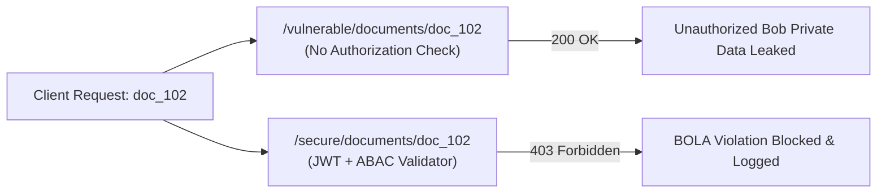

# API Security & Broken Object Level Auth (BOLA / IDOR) Defense

[](LICENSE)
[](https://github.com/toprakahmetaydogmus/06-api-security-bola-testbed/actions)
[](#)

Geliştirici: **Toprak Ahmet Aydoğmuş**

FastAPI ile geliştirilmiş, OWASP API Top 10 (özellikle API1:2023 BOLA) açıklarını gösteren ve ABAC (Attribute-Based Access Control) ile güvenli hale getiren testbed.

---

## 🏗️ Karşılaştırmalı API Güvenlik Mimarisi



---

## ⚡ Hızlı Başlangıç & Test

```bash
git clone https://github.com/toprakahmetaydogmus/06-api-security-bola-testbed.git
cd 06-api-security-bola-testbed

python -m unittest discover tests/
```

---

## 📜 Lisans
MIT License - **Toprak Ahmet Aydoğmuş**
